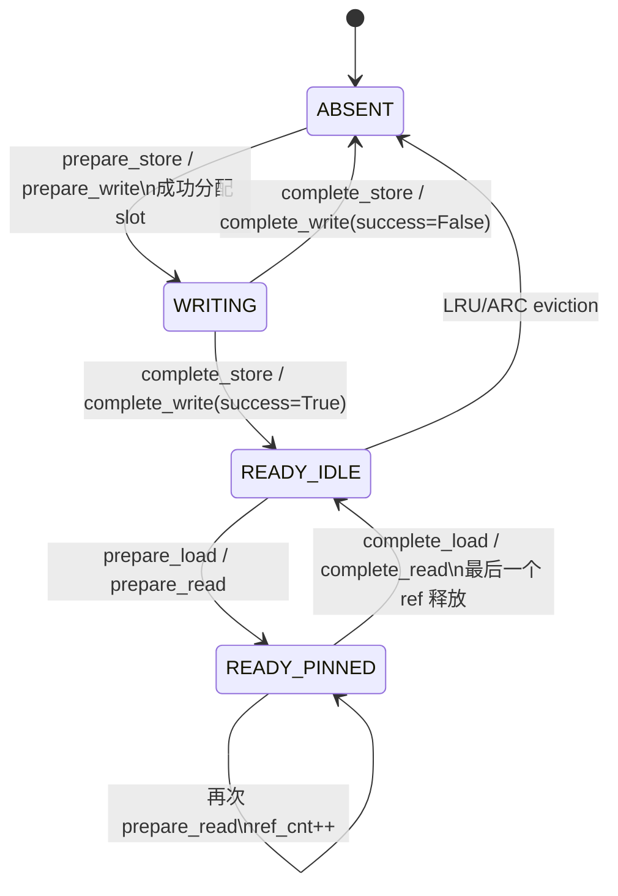
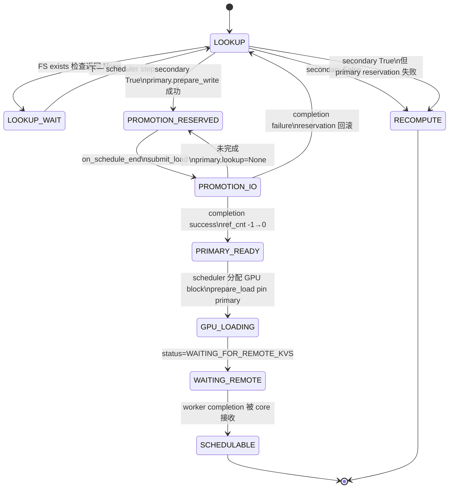
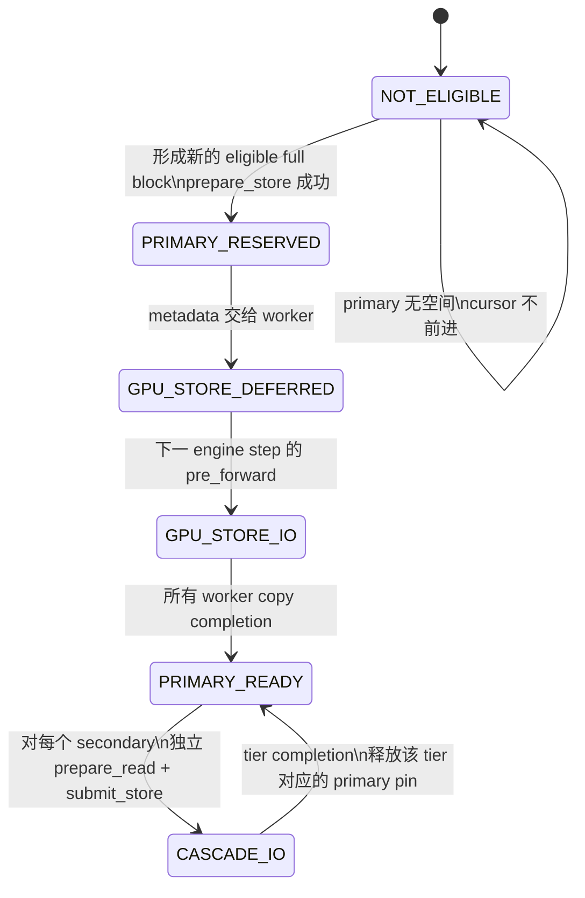
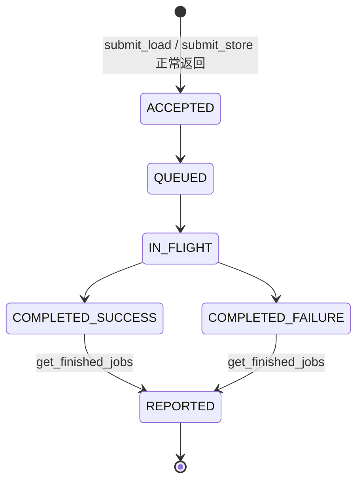
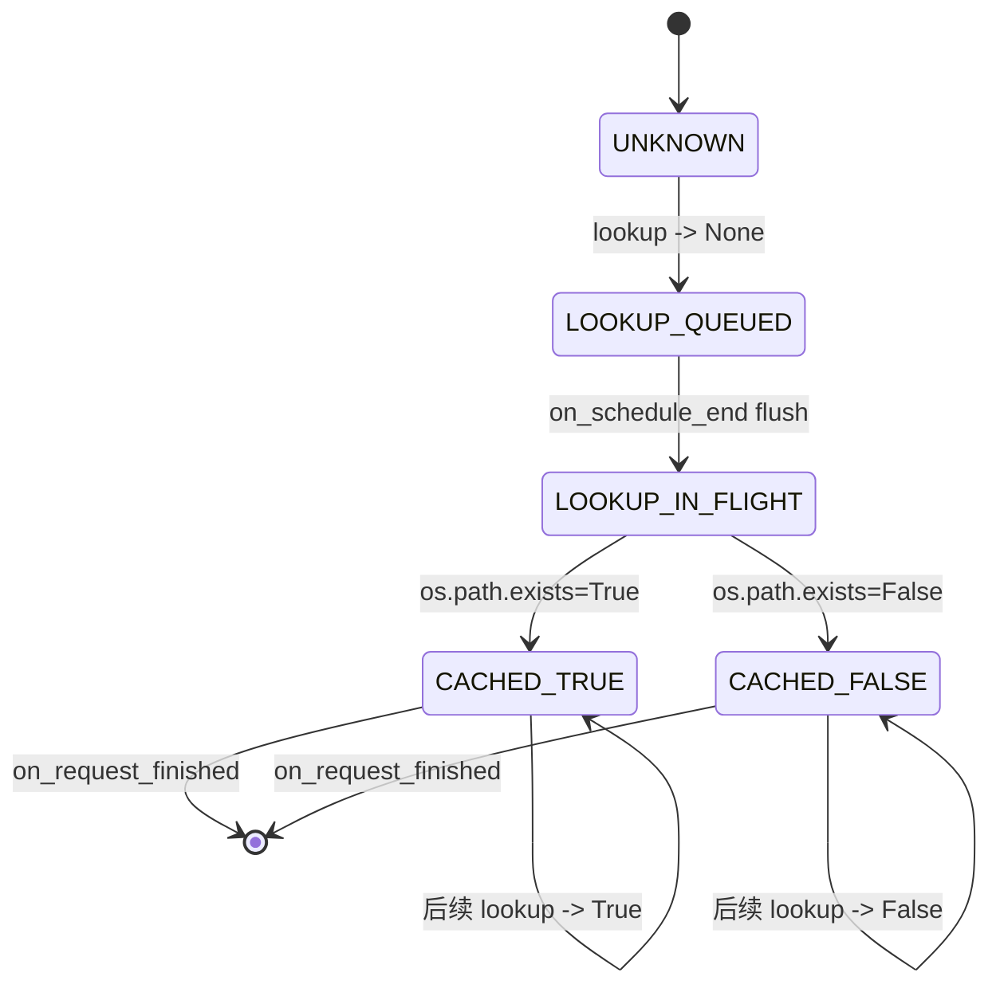

# vLLM 0.24.0 second-tier 调用状态机

状态：**SOURCE-AUDITED / NO PERFORMANCE CLAIMS**  
上游版本：vLLM `v0.24.0`  
固定 commit：`ee0da84ab9e04ac7610e28580af62c365e898389`

本文只回答三件事：

1. scheduler 在什么状态下会调用 second tier；
2. block、request 和异步 job 如何跨 scheduler step 迁移；
3. 新的 second-tier engine 必须保持哪些上层可观察语义。

本文不回答 second tier 在线上 trace 中出现得多不多，也不声称更快的 backend
一定能改善 TTFT 或吞吐。所有“确定”结论均来自固定 commit 的源码；需要测量的
部分显式标为实验问题。

---

## 1. 先给结论：不是一条 I/O，而是两道异步屏障

second-tier hit 的读取路径固定为：

```text
secondary ── promotion ──> CPU primary ── GPU load ──> GPU KV cache
             barrier 1                       barrier 2
```

- second tier 只接触 CPU primary 的 slot，不直接接触 GPU；
- `lookup=True` 只表示该 key 在 **CPU primary 已经 ready**；
- secondary 自己返回 `True` 时，上层不会立刻把它当成命中，而是先在 primary
  预留 slot，返回 `None`，到后续 step 再查；
- promotion 完成后，scheduler 才创建 CPU→GPU load job；
- CPU→GPU 完成后，请求还要在下一次 scheduler 状态更新中从
  `WAITING_FOR_REMOTE_KVS` 恢复。

因此，uring-slab 替换的正式边界是：

```text
TieringOffloadingManager
    ├── lookup / submit_load / submit_store / completion
    ▼
UringSecondaryTierManager adapter
    ▼
C++ uring-slab data engine
```

它不能通过“只替换 engine”消除 CPU staging、GPU↔CPU copy 或 scheduler-step
量化延迟。这正是端到端收益可能小于微基准收益的结构性原因。

源码依据：

- [`JobMetadata.is_promotion` 对两个方向的定义][tier-manager-state]
- [`SecondaryTierManager` 的 scheduler-process / no-GPU 边界][secondary-base]
- [promotion 完成后才令 primary block ready][tier-completion]
- [CPU→GPU load 完成后请求在后续调度恢复][core-remote-resume]

---

## 2. 三值 lookup 是整个状态机的控制信号

`lookup(key, req_context)` 的三种结果不是普通 cache API 的 hit/miss：

| 返回值 | 精确含义 | scheduler 行为 |
|---|---|---|
| `True` | key 已在 CPU primary 且可读 | 把连续命中前缀纳入 external hit，随后创建 CPU→GPU load |
| `None` | 现在无法得出最终结果，或数据正在变为 ready | 当前 step 跳过该请求，下一 step 重新查询 |
| `False` | 所有 tier 均 miss，或 secondary hit 但 primary 无法接纳 promotion | external miss；该段由模型重算 |

核心调度器收到 `ext_tokens is None` 时会把当前请求从候选队列取出并放回
`step_skipped_waiting`，不是把它判为 miss。[源码][core-none]

`TieringOffloadingManager.lookup()` 的优先级是：

```text
poll completions
    │
    ├─ primary True  ───────────────> True
    ├─ primary None  ───────────────> None（不查 secondary）
    └─ primary False
          │
          └─ 按配置顺序扫描 secondary tiers
               ├─ 首个 True + primary 可预留 ─> None，并排队 promotion
               ├─ 首个 True + primary 不可预留 -> False
               ├─ 没有 True，但至少一个 None ─> None
               └─ 全部 False ────────────────> False
```

注意：某个较早 tier 返回 `None` 不会阻止继续查后面的 tier；后面的 `True`
仍可胜出。只有 primary 返回 `None` 才会立即短路所有 secondary。
[源码][tier-lookup]

---

## 3. CPU primary 的 key 状态机

primary 用 `BlockStatus.ref_cnt` 同时表达 ready、pin 和 write-in-flight：



| 状态 | `ref_cnt` | `primary.lookup()` | 可被 eviction |
|---|---:|---|---|
| `ABSENT` | 无条目 | `False` | 不适用 |
| `WRITING` | `-1` | `None` | 否 |
| `READY_IDLE` | `0` | `True` | 是 |
| `READY_PINNED` | `>0` | `True` | 否 |

关键约束：

- `prepare_store/prepare_write` 是全批次 admission；容量不足时返回 `None`，
  不留下部分新 reservation；
- 已存在的 key（包括 `ref_cnt=-1` 的 in-flight key）不会再次分配；
- `prepare_load/prepare_read` 增加 ref count，保护 source slot；
- 只有 `ref_cnt=0` 的 ready block 可以进入 eviction policy；
- promotion 与 GPU→CPU store 共用同一个 `WRITING(-1)` reservation 状态。

`prepare_read/write` 是 `prepare_load/store` 的别名，不是另一套生命周期。
[别名源码][primary-aliases] [lookup 源码][primary-lookup]
[write reservation 源码][primary-write] [completion 源码][primary-complete]

---

## 4. 读路径：secondary hit 到请求恢复

### 4.1 Request-level 状态机



这里的 `RECOMPUTE` 是“second tier 不再贡献这个 external prefix”的结果，
不代表 request 失败。

### 4.2 Promotion 的精确调用顺序

1. `lookup()` 先处理可见的 secondary completion；
2. primary miss 后，某个 secondary 返回 `True`；
3. manager 立即调用 `primary.prepare_write([key])`；
4. slot 立刻进入 `ref_cnt=-1`，同 step 的重复查询只能看到 `None`；
5. key 和 primary block id 暂存在
   `_pending_load_submissions[tier][req_id]`；
6. `on_schedule_end()` 按 `(tier, request)` 合成一个 `JobMetadata`；
7. manager 先写入 `_transfer_jobs[job_id]`，再调用
   `tier.submit_load(job_metadata)`；
8. tier 异步把 secondary 数据写入给定的 primary slot；
9. `get_finished_jobs()` 返回一个且仅一个 terminal `JobResult`；
10. success 时 `primary.complete_write(..., True)` 令所有 reservation ready；
11. failure 时 `primary.complete_write(..., False)` 删除仍处于 write 状态的
    key 并归还 slot。

[reserve 与 batching 源码][tier-promotion]
[flush 源码][tier-promotion-flush]
[completion 源码][tier-completion]

### 4.3 CPU→GPU load 是第二个独立 job

primary ready 只结束了 promotion。之后：

1. connector 返回 external hit token 数，并令 `load_kv_async=True`；
2. core 不为该请求安排模型计算 token；
3. core 分配目标 GPU blocks；
4. connector `update_state_after_alloc()` 创建 GPU load job，并通过
   `manager.prepare_load()` pin 住 primary source slots；
5. request 进入 `WAITING_FOR_REMOTE_KVS`；
6. worker 在 `pre_forward()` 中提交当前 load job；它可以与该 batch 中其他
   request 的 model forward 重叠；
7. worker completion 经 `finished_recving` 回到 core；
8. 下一次调度时 core cache GPU blocks；若整个 prompt 全命中，仍回退一个
   token 以重新计算并产生 logits；
9. request 回到 `WAITING` 或 `PREEMPTED`，重新参与调度。

[core admission 与 waiting 状态][core-gpu-load]
[connector 创建 load job][offload-create-load]
[worker pre-forward 提交顺序][worker-start]
[core 恢复逻辑][core-remote-resume]

所以应分别记录：

```text
secondary_lookup_wait
promotion_queue + promotion_io + promotion_completion_observe
gpu_load_queue + gpu_load_copy + gpu_completion_observe
```

只测 `pread/io_uring read` 无法解释完整 TTFT。

### 4.4 FS cold lookup 的最早典型时间线

原生 FS 的 `lookup()` 自身也异步做 `os.path.exists`。lookup 状态按 key
共享，并由引用该 key 的活跃 request 维持生命周期，所以第一次访问一个
尚无缓存状态的 key 时通常还有一层 metadata wait：

```text
step A: FS lookup -> None
        on_schedule_end -> 提交 exists batch

step B: exists completion 可见，FS lookup -> True
        primary reservation -> None
        on_schedule_end -> submit promotion

step C 或更晚: promotion completion 可见，primary lookup -> True
              scheduler 创建 CPU→GPU load，request 进入 WAITING_FOR_REMOTE_KVS

worker completion 后的下一次 scheduler 更新:
              request 恢复为 WAITING/PREEMPTED
```

这是最早的典型路径，不是 latency 上界。线程排队、I/O 时长和 completion
轮询相位都可能增加 step。若该 request 的 FS existence 已缓存，则 A 可消失；
若 primary 已命中，则整个 secondary 路径都不会发生。

[FS lookup 委托源码][fs-lookup]
[异步 lookup 状态机][async-lookup]

---

## 5. 写路径：GPU 新 block 到所有 secondary

### 5.1 “每 step 调用 store builder”不等于“每 step 重写所有 KV”

`_build_store_jobs()` 每个 metadata build 都会运行，但只处理：

- 本 step 被调度的 request；
- 从该 request 的 `next_stored_block_idx` 开始新形成的完整 block；
- 通过 prompt-only、per-request token cap、alignment、sliding-window /
  EAGLE 等过滤后的 block；
- 不已存在于 primary 的 key。

若 `primary.prepare_store()` 因容量/eviction 不足返回 `None`，cursor 不前进，
后续被调度的 step 可以重试。若过滤后没有新 key，cursor 可以前进而不发 I/O。
[源码][offload-build-store]

默认行为下，写状态机是：



### 5.2 GPU→CPU store 有意延迟一 step

当前 step 的 `store_jobs` 在 worker post-forward 的 `get_finished()` 中只被加入
`_unsubmitted_store_jobs`；下一 step 的 `start_kv_transfers()` 才先提交这些
旧 store，再提交当前 load。源码注释说明这样做是为了让 offload 开始于 token
sampling 相关 transfer 之后。

这能证明的是**提交顺序**，不能单凭源码推导磁盘读写的严格全局优先级。
[wrapper 源码][connector-store-defer] [worker 源码][worker-start]

### 5.3 Cascade 是 fan-out，不是逐层串联

GPU→CPU store 的所有 worker completion 被 scheduler 收齐后：

1. `primary.complete_store()` 令 block ready；
2. 对每个 configured secondary tier，各调用一次 `primary.prepare_read()`；
3. 因而同一 primary key 对每个 tier 各增加一个 pin ref；
4. 为每个 tier 建立独立 `JobMetadata(is_promotion=False)`；
5. 分别 `tier.submit_store()`，即对所有 secondary **fan-out**；
6. 每个 cascade 完成时，不论 success/failure，只调用一次
   `primary.complete_read()` 释放该 tier 的 pin。

一个 secondary 的 store failure 不回滚已经 ready 的 CPU primary，也不传播为
GPU store failure；manager 本身没有 secondary cascade retry。之后能否命中，
由该 tier 的 `lookup()` 结果决定。
[cascade 源码][tier-cascade] [cascade completion][tier-completion]

---

## 6. Manager 内部 job 状态机

`TieringOffloadingManager` 有三类关键内部状态：

| 状态容器 | 内容 | 生命周期 |
|---|---|---|
| `_pending_load_submissions` | 已预留 primary、尚未调用 secondary `submit_load` 的 promotion | `lookup` 创建；本 step `on_schedule_end` flush |
| `_transfer_jobs` | 已向 secondary 提交的 promotion/cascade | submit 前登记；completion poll 时删除 |
| `_processed_jobs_this_step` | completion poll gate | 第一次 poll 置真；`on_schedule_end` 中置假 |

[源码][tier-manager-state]

对 adapter 而言，一个 accepted secondary job 必须满足：



上层隐含要求：

- scheduler 线程上的 `submit_*` 和 `get_finished_jobs()` 应轻量、非阻塞；
- 每个正常 accepted job 最终恰好报告一次 `JobResult`；
- 不得报告未知或重复 job id，否则 manager 会 assertion；
- 可恢复 I/O 错误应通过 `JobResult(success=False)` 报告；
- `submit_*` 不应在 manager 已登记 `_transfer_jobs` 后同步抛出可恢复异常，
  因为调用点没有 rollback；
- `block_ids[i]` 必须对应 `keys[i]`，非空 job 必须最终完成。

这些不是对任意理想接口的猜测，而是从 manager 的登记顺序和 completion
assertion 直接推出的 adapter 约束。[提交顺序][tier-promotion-flush]
[completion assertion][tier-completion] [抽象接口][secondary-base]

---

## 7. Completion poll gate：源码注释与实际调用顺序不完全一致

`_maybe_process_finished_jobs()` 的注释说“at most once per step”。但实际顺序是：

```text
build_connector_meta()
  1. manager.on_schedule_end()
       - maybe_process_finished_jobs()
       - _processed_jobs_this_step = False
       - flush promotions
       - tier.on_schedule_end()
  2. _build_store_jobs()
       - manager.prepare_store()
       - maybe_process_finished_jobs()   # 可以在同一 build 中再次 poll
```

因此，从代码可直接得出两点：

1. 同一个 `build_connector_meta()` 内可能发生两次 secondary completion poll；
2. 第 2 次 poll 会把 gate 留为 `True`。若 completion 在它之后到达，下一 step
   的 lookup 可能因 gate 已真而跳过 poll，直到稍后的调用点才被承认。

这不是 engine correctness failure，但会把物理 I/O 完成时间量化成额外的
“completion→observed” step 延迟。实验 instrumentation 必须区分：

```text
io_complete_timestamp
job_result_enqueued_timestamp
get_finished_jobs_polled_timestamp
primary_complete_write_timestamp
request_resumed_timestamp
```

否则会把 scheduler polling lag 错归因于 FS 或 uring-slab I/O。

[poll gate 源码][tier-poll-gate]
[on_schedule_end 顺序][tier-schedule-end]
[build_connector_meta 顺序][offload-build-meta]

---

## 8. Request finish、block reuse 与 engine 存活

### 8.1 Request finish 不等待 cascade

offloading scheduler 只把 GPU↔CPU job 放在自己的 `_jobs` 中等待。最后一个
GPU→CPU store completion 到达时，执行顺序可以是：

```text
manager.complete_store()
    └─ 为 secondary 新建 cascade job
清理 GPU store job
manager.on_request_finished()
```

也就是说，request 已结束不等于 secondary cascade 已结束；这是被允许的。
secondary tier 不能把 `on_request_finished()` 理解为“取消这个 request 的
accepted I/O”。FS 只用它清理 per-request lookup cache。
[scheduler finish 顺序][offload-request-finish]

### 8.2 GPU block 复用有 fence

仍在进行 GPU→CPU store 的 GPU block 若被重新分配，scheduler 会把相关 job
加入 `jobs_to_flush`，worker 在复用前 `wait()`。这保护 GPU source block；
secondary cascade 则读取已经独立存在的 CPU primary slot，并由 ref count
保护。[源码][offload-build-meta] [worker fence][worker-start]

### 8.3 没有可运行请求时仍可能继续 step

只要 scheduler 自己还有 GPU↔CPU `_jobs`，或 tiering manager 还有
`_transfer_jobs` / tier-internal pending work，`has_pending_push_work()` 就会
要求 engine 继续 stepping。[scheduler 源码][offload-pending]
[tier manager 源码][tier-pending]

候选 engine 若在 completion 入队前还有内部 queued、in-flight 或 rollback
工作，应覆盖 `has_pending_work()`。仅依靠基类默认 `False` 会让这部分内部
状态对 engine 不可见。

---

## 9. Reset 与 shutdown 是不同协议

`reset_cache()` 的顺序是：

1. 对每个 secondary 调用 `drain_jobs()`；
2. 无 gate 地收完所有 completion；
3. 清除尚未 submit、但已占 primary reservation 的 pending promotions；
4. reset CPU primary；
5. 保留 persistent secondary data。

`drain_jobs()` 返回时必须保证没有 I/O 再触碰 primary memoryview，并且
completion 已返回或仍可被随后 `get_finished_jobs()` 取到。
[reset 源码][tier-reset] [drain contract][secondary-drain]

`shutdown()` 则先关闭 secondaries，再关闭 primary。候选 engine 的 shutdown
必须防止后台线程在 primary memory 已释放后继续 DMA/readv/writev。
[源码][tier-reset]

---

## 10. 原生 FS tier 的附加状态与失败边界

### 10.1 Async existence lookup

FS lookup 状态按 key 缓存，并记录正在引用它的 request：



这个结果在 request 生命周期内没有 TTL，也不会因 store/load 修改而主动
失效。[源码][async-lookup]

由此可直接推出一个 FS-specific 失败环：

1. existence cache 已是 `True`；
2. FS promotion read 失败，原生实现删除 source file；
3. manager 回滚 primary reservation，但没有 promotion failure backoff；
4. 同一 request 再查时，FS lookup 仍可能返回缓存的 `True`；
5. manager 再次 promotion，可能重复失败，直到 request cleanup。

这是固定版本源码的风险边界，不是候选 engine 必须复制的正确行为。
[FS load failure 删除文件][fs-io] [promotion failure 回滚][tier-completion]

### 10.2 FS I/O 与队列

原生 FS 的相关事实：

- file-per-key；
- `submit_store/load` 把一个 job 拆成 per-block tasks；
- 双队列线程池有 load-preferred 与 store-preferred 两组 worker，但两组均可
  steal 另一方向，因此不是严格的全局 read priority；
- store 使用临时文件、单次 direct write、close、`os.replace`，没有 fsync；
- load 使用 direct `readv` 写入 primary slot；
- 任一 task 失败会使 job 的最终 `JobResult.success=False`；
- 最后一个 task 才产生唯一 job completion。

[FS manager][fs-manager] [I/O][fs-io] [thread pool][fs-thread-pool]

这些细节属于 baseline treatment。候选 engine 应保持上层 job 语义，而不必
复制 file-per-key、双队列线程或具体提交模型。

---

## 11. 新 second-tier engine 的最小可观察合同

为了在**不改上层语义**的主实验里替换 FS，adapter 至少必须正确实现：

```text
lookup(key, req_context) -> True | False | None
submit_store(job_metadata) -> None
submit_load(job_metadata) -> None
get_finished_jobs() -> Iterable[JobResult]
on_new_request(req_context) -> RequestOffloadingContext
on_request_finished(req_context) -> None
on_schedule_end() -> None
touch(keys, req_context) -> None
has_pending_work() -> bool
drain_jobs() -> None
shutdown() -> None
```

按状态机整理后的验收条件：

| 类别 | 必须保证 |
|---|---|
| Lookup | resident ready 才返回 `True`；in-flight/async undecided 返回 `None`；确定 absent 返回 `False` |
| Addressing | `keys` 与 `block_ids` 等长、同序；只访问上层给定 primary slot |
| Submit | 非阻塞 accepted；同步异常只用于不可恢复的调用错误 |
| Completion | accepted job exactly once terminal result；未知/重复 id 禁止 |
| Store visibility | job 成功前不得把部分新 key 暴露成 ready |
| Load safety | load 期间不能让 secondary source slot 被 eviction/reuse |
| Capacity | admission、reservation、pin、eviction 无泄漏 |
| Failure | 失败通过 completion 报告；释放所有内部 pin/reservation |
| Liveness | queued/in-flight/rollback/completed-unpolled 存在时 pending 为真 |
| Lifecycle | request finish 不取消 accepted I/O；drain 后不再触碰 primary memory |

本项目允许不实现 production 通用能力，但不能省略正式实验路径会经过的状态：
duplicate、有限容量、in-flight、failure rollback、exactly-once completion、
drain 和 block reuse safety。

---

## 12. 对实验设计的直接含义

状态机本身已经确定，无需实验再证明：

1. second tier 只有在 GPU miss、CPU primary miss、secondary hit 且 primary
   promotion reservation 成功时才真正进入读路径；
2. primary 满时上层选择 recompute，而不是无限等待 second tier；
3. secondary→CPU 和 CPU→GPU 是两个独立异步阶段；
4. store 只针对新形成且 eligible 的完整 block，不是每 step 重写全部 KV；
5. cascade 向所有 secondary fan-out；
6. request finish 可以早于 cascade finish；
7. scheduler-step polling lag 可能掩盖 backend I/O 改善。

仍必须实验回答：

- 在给定 prefix length、load pressure、store pressure 下，各漏斗阶段占比；
- primary reservation failure 的频率；
- promotion I/O 与 completion-observation lag 各占 TTFT 多少；
- load/store 竞争下，FS 与 uring-slab 的 queueing 差异；
- 微基准的 secondary I/O 收益能否穿过 GPU copy 和 scheduler barriers，
  转化为端到端 TTFT 或吞吐收益。

建议所有端到端 run 至少输出以下计数：

```text
lookup_primary_true / none / false
lookup_secondary_true / none / false
promotion_reservation_success / failure
promotion_submit / success / failure
cascade_submit / success / failure
primary_to_gpu_load_submit / complete
request_lookup_skipped_steps
request_waiting_remote_steps
completion_to_observed_ns
```

这样即使最终没有 serving 收益，也能判断原因是：

```text
second-tier hit 太少
vs primary admission 失败
vs backend I/O 没改善
vs 改善被 scheduler polling 量化
vs GPU→CPU/CPU→GPU 路径成为主瓶颈
```

---

## 13. 审计索引

以下链接全部固定到 commit
`ee0da84ab9e04ac7610e28580af62c365e898389`，不随 vLLM main 漂移。

[secondary-base]: https://github.com/vllm-project/vllm/blob/ee0da84ab9e04ac7610e28580af62c365e898389/vllm/v1/kv_offload/tiering/base.py#L23-L209
[secondary-drain]: https://github.com/vllm-project/vllm/blob/ee0da84ab9e04ac7610e28580af62c365e898389/vllm/v1/kv_offload/tiering/base.py#L211-L225
[tier-manager-state]: https://github.com/vllm-project/vllm/blob/ee0da84ab9e04ac7610e28580af62c365e898389/vllm/v1/kv_offload/tiering/manager.py#L145-L170
[tier-poll-gate]: https://github.com/vllm-project/vllm/blob/ee0da84ab9e04ac7610e28580af62c365e898389/vllm/v1/kv_offload/tiering/manager.py#L179-L225
[tier-completion]: https://github.com/vllm-project/vllm/blob/ee0da84ab9e04ac7610e28580af62c365e898389/vllm/v1/kv_offload/tiering/manager.py#L192-L225
[tier-lookup]: https://github.com/vllm-project/vllm/blob/ee0da84ab9e04ac7610e28580af62c365e898389/vllm/v1/kv_offload/tiering/manager.py#L228-L269
[tier-promotion]: https://github.com/vllm-project/vllm/blob/ee0da84ab9e04ac7610e28580af62c365e898389/vllm/v1/kv_offload/tiering/manager.py#L271-L318
[tier-promotion-flush]: https://github.com/vllm-project/vllm/blob/ee0da84ab9e04ac7610e28580af62c365e898389/vllm/v1/kv_offload/tiering/manager.py#L320-L342
[tier-cascade]: https://github.com/vllm-project/vllm/blob/ee0da84ab9e04ac7610e28580af62c365e898389/vllm/v1/kv_offload/tiering/manager.py#L481-L537
[tier-schedule-end]: https://github.com/vllm-project/vllm/blob/ee0da84ab9e04ac7610e28580af62c365e898389/vllm/v1/kv_offload/tiering/manager.py#L567-L578
[tier-pending]: https://github.com/vllm-project/vllm/blob/ee0da84ab9e04ac7610e28580af62c365e898389/vllm/v1/kv_offload/tiering/manager.py#L581-L587
[tier-reset]: https://github.com/vllm-project/vllm/blob/ee0da84ab9e04ac7610e28580af62c365e898389/vllm/v1/kv_offload/tiering/manager.py#L602-L636
[primary-aliases]: https://github.com/vllm-project/vllm/blob/ee0da84ab9e04ac7610e28580af62c365e898389/vllm/v1/kv_offload/tiering/manager.py#L62-L102
[primary-lookup]: https://github.com/vllm-project/vllm/blob/ee0da84ab9e04ac7610e28580af62c365e898389/vllm/v1/kv_offload/cpu/manager.py#L114-L165
[primary-write]: https://github.com/vllm-project/vllm/blob/ee0da84ab9e04ac7610e28580af62c365e898389/vllm/v1/kv_offload/cpu/manager.py#L168-L236
[primary-complete]: https://github.com/vllm-project/vllm/blob/ee0da84ab9e04ac7610e28580af62c365e898389/vllm/v1/kv_offload/cpu/manager.py#L238-L269
[core-none]: https://github.com/vllm-project/vllm/blob/ee0da84ab9e04ac7610e28580af62c365e898389/vllm/v1/core/sched/scheduler.py#L672-L736
[core-gpu-load]: https://github.com/vllm-project/vllm/blob/ee0da84ab9e04ac7610e28580af62c365e898389/vllm/v1/core/sched/scheduler.py#L782-L938
[core-remote-resume]: https://github.com/vllm-project/vllm/blob/ee0da84ab9e04ac7610e28580af62c365e898389/vllm/v1/core/sched/scheduler.py#L2355-L2404
[offload-create-load]: https://github.com/vllm-project/vllm/blob/ee0da84ab9e04ac7610e28580af62c365e898389/vllm/distributed/kv_transfer/kv_connector/v1/offloading/scheduler.py#L683-L779
[offload-build-store]: https://github.com/vllm-project/vllm/blob/ee0da84ab9e04ac7610e28580af62c365e898389/vllm/distributed/kv_transfer/kv_connector/v1/offloading/scheduler.py#L831-L1012
[offload-build-meta]: https://github.com/vllm-project/vllm/blob/ee0da84ab9e04ac7610e28580af62c365e898389/vllm/distributed/kv_transfer/kv_connector/v1/offloading/scheduler.py#L1014-L1051
[offload-pending]: https://github.com/vllm-project/vllm/blob/ee0da84ab9e04ac7610e28580af62c365e898389/vllm/distributed/kv_transfer/kv_connector/v1/offloading/scheduler.py#L1053-L1059
[offload-request-finish]: https://github.com/vllm-project/vllm/blob/ee0da84ab9e04ac7610e28580af62c365e898389/vllm/distributed/kv_transfer/kv_connector/v1/offloading/scheduler.py#L1106-L1201
[worker-start]: https://github.com/vllm-project/vllm/blob/ee0da84ab9e04ac7610e28580af62c365e898389/vllm/distributed/kv_transfer/kv_connector/v1/offloading/worker.py#L271-L296
[connector-store-defer]: https://github.com/vllm-project/vllm/blob/ee0da84ab9e04ac7610e28580af62c365e898389/vllm/distributed/kv_transfer/kv_connector/v1/offloading_connector.py#L89-L120
[fs-lookup]: https://github.com/vllm-project/vllm/blob/ee0da84ab9e04ac7610e28580af62c365e898389/vllm/v1/kv_offload/tiering/fs/manager.py#L133-L169
[async-lookup]: https://github.com/vllm-project/vllm/blob/ee0da84ab9e04ac7610e28580af62c365e898389/vllm/v1/kv_offload/tiering/async_lookup.py#L71-L231
[fs-manager]: https://github.com/vllm-project/vllm/blob/ee0da84ab9e04ac7610e28580af62c365e898389/vllm/v1/kv_offload/tiering/fs/manager.py#L83-L191
[fs-io]: https://github.com/vllm-project/vllm/blob/ee0da84ab9e04ac7610e28580af62c365e898389/vllm/v1/kv_offload/tiering/fs/io.py#L32-L101
[fs-thread-pool]: https://github.com/vllm-project/vllm/blob/ee0da84ab9e04ac7610e28580af62c365e898389/vllm/v1/kv_offload/tiering/fs/thread_pool.py#L21-L180
